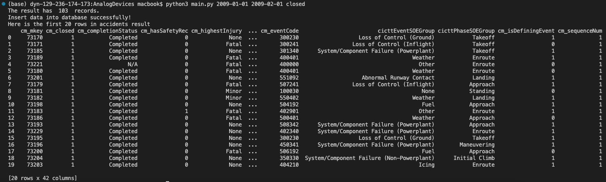
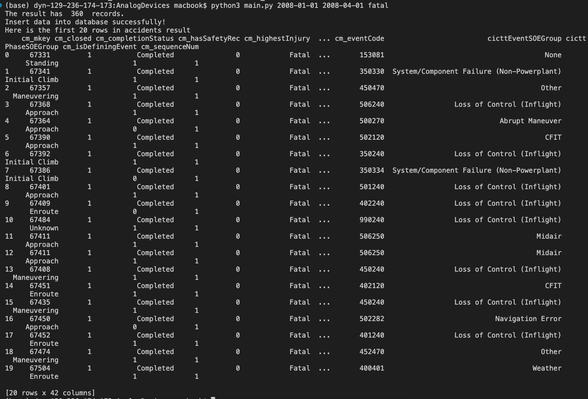
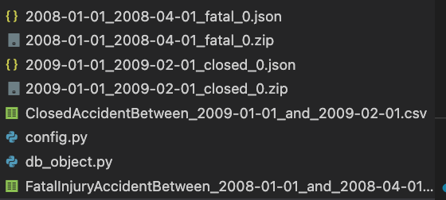

# NTSB_Accident_Report

## A project written in Python to fetch NTSB accident reports with given time period and other constraints.
## Introduction

This project is a coding test for analog devices. The project contains the following processes:

* With given time period, the program fetches the num of result first; if the result is more than 10,000 accident records, there would be more than one json file(1 json file can contain 10,000 rows maximum), so it requires to read several json files. Store the name of each json file in a list.

* Download zip files and extract those json file.

* Activate ntsb.db database via sqlite and insert data in json files into ntsb.db.

* Query the data with given start date and end date; and get a csv file with overall data automatically.
there are two kind of queries we can choose: 
    (a) Retrieve all closed accident reports (call "closed" in cli)
    (b) Retrieve all accidents that resulted in at least one fatal injury (call "fatal" in cli)

## Structure
    /main.py (main function)
    /config.py (constants)
    /db_object.py (create db model using sqlalchemy classes)
    /query.py (two query functions)
    /ntsb.db
    /demos (results of unit tests)
        /2008-01-01_to_2008-04-01_fatalInjuryAccident_preview.png
        /2009-01-01_to_2009-02-01_closedAccident_preview.png
        /newCSVFiles.png

## Technologies
    Python 3.8
    SQLite3
    sqlalchemy
    pandas
    requests

## Launch
To lauch the program, here are some unit tests:

1) for example, call "python3 main.py 2009-01-01 2009-02-01 closed" in command line, 
to fetch all the closed accident records between 2019-01-01 and 2019-02-01, 
it will show a table with first 20 rows of records in terminal 
and also automatically download a csv file with all the records.

2) call "python3 main.py 2008-01-01 2008-04-01 fatal" in command line, 
to fetch all accident records with more than one fatal injury between 2018-01-01 and 2018-04-01, 
it will show a table with first 20 rows of records in terminal 
and also automatically download a csv file with all the records.

All the new files are saved in the current folder.

    
